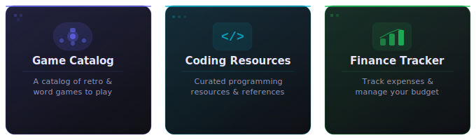

<div align="center">
  
</div>

---

## About Me

```yaml
name: Zheng Yang
education: Computer Science @ NUS
focus_areas: [Database Systems, Artificial Intelligence]
current_role: Software Engineer Intern @ GovTech
next_chapter: Software Engineer @ DBS
```

[](https://teozhengyang.com/)
[](https://www.linkedin.com/in/teozhengyang/)
[](mailto:teozhengyang@gmail.com)

---

## What I'm Building



---

## Tech Stack

**Languages**


**Frontend**


**Backend**


**Databases**


**DevOps**


**AI / ML**


---

## GitHub Stats


